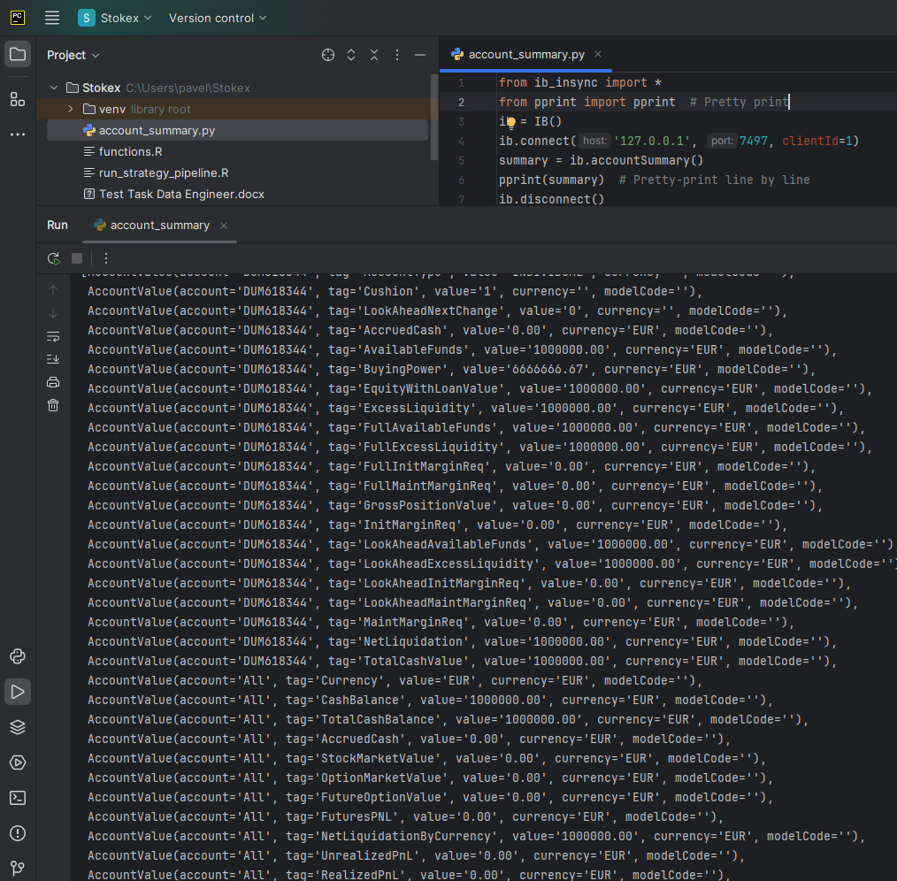

# Hedge Fund Data Engineer Task – Interactive Brokers Pipeline

Created by Pavel on June 8 2025 for Stokex

## ✅ Summary

This project implements a full end-to-end data pipeline to:
- Connect to **Interactive Brokers (IBKR) TWS API**
- Collect **real-time Forex data (EURUSD)**
- Run an **R-based trading strategy**
- Simulate **trades and log executions**
- Save output to **PostgreSQL** and files
- Automate everything using **Apache Airflow**
- Orchestrate the environment via **Docker Compose**

---

## ⚠ Known Limitations

- **IBKR demo account restricts real Forex orders** via API due to currency leverage exposure.
- Orders are simulated but reflect realistic execution structure.

## ✅ Steps Completed

1. **IBKR Setup & TWS Configuration**
   - Created demo account
   - Installed TWS
   - Enabled API access (port 7497)

2. **API Connection**
   - Used `ib_insync` to connect and call `.accountSummary()`
   - Verified connectivity and funds

3. **Data Collection**
   - Collected ~1 hour of Forex (EUR/USD) 5-minute bars via `reqHistoricalData`
   - Saved to `realtime_forex_input.csv`

4. **Strategy Execution (R)**
   - Calculated EMA & Aroon indicators
   - Identified entry/exit points
   - Output saved as `dt_positions.csv`

5. **Order Execution (Simulated)**
   - IBKR demo account blocked live FX orders (Error 201)
   - Simulated `BUY` and `SELL` based on strategy signals
   - Logged simulated executions to `execution_log.csv`

---

## 🖼 Screenshot



---

## 📁 File Structure

| File                       | Description                                      |
|----------------------------|--------------------------------------------------|
| `account_summary.py`       | Verifies API connection & account status         |
| `realtime_forex_collector.py` | Collects real-time/historical Forex data    |
| `realtime_forex_input.csv` | Cleaned price data for strategy input            |
| `functions.R`              | R helper functions for strategy                  |
| `run_strategy_pipeline.R`  | Executes EMA/Aroon trading logic                 |
| `dt_positions.csv`         | Strategy output with entry/exit times            |
| `execute_positions.py`     | Simulates trade execution & logs results         |
| `execution_log.csv`        | Final output with trade times, prices, commissions |
| `screenshot.png`           | IBKR demo account proof of working setup         |

---

## 🚀 Instructions

### 1. Set Up IBKR Paper Trading

- Create an IBKR **demo account**: [Free Trial](https://www.interactivebrokers.com/en/trading/free-trial.php)
- Wait 1 day for IB systems to reset before API access is granted
- Download and run **Trader Workstation (TWS)** in demo mode
- In TWS:
  - Enable API access via *Global Configuration → API → Settings*
  - Allow connections from localhost, uncheck "Read-only API"

---

### 2. Start Dockerized Environment

```
docker compose up --build
```
Starts Postgres and Airflow

Automatically sets up database schema via postgres-init/create_schema.sql

3. Run Workflow via Airflow
Open Airflow UI at http://localhost:8080

Trigger the DAG: ib_pipeline_dag

The DAG will:

Pull real-time EURUSD data (using 1-min historical bars)

Store data into PostgreSQL

Run strategy (run_strategy_pipeline.R)

Simulate trade orders and log them

4. Outputs
📄 dt_positions.csv – Strategy output positions

📄 execution_log.csv – Simulated trade executions

🖼 screenshot.png – Account summary API proof

🗃 PostgreSQL DB – Stores all real-time and metadata

## 🧠 Bonus Features
✅ PostgreSQL schema with indexing and partition-ready structure

✅ Airflow DAG for pipeline automation

✅ Docker Compose orchestration

✅ Simulated trade execution with log output

✅ R strategy integration via Rscript CLI

## 🗃 PostgreSQL Schema Overview
schema: ibkr_data

realtime_data: live Forex prices

strategy_positions: strategy-generated trade signals

execution_log: simulated trade actions